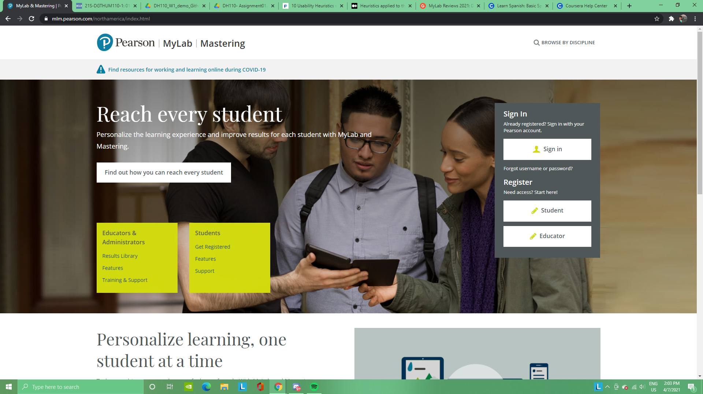

# DH110-Week 1
## Mariel Carreon 
### DH110: User Experience and Design (Spring 2021)
##### In this project, I will be evaluting the design of the following web/apps: MyLab & Mastering and . This was conducted in reference to Neilson's 10 Usability Heuristics, and I hope to give suggestions to help improve and maximize the user's experience.

## Website #1: MyLab & Mastering (https://mlm.pearson.com/northamerica/index.html)

